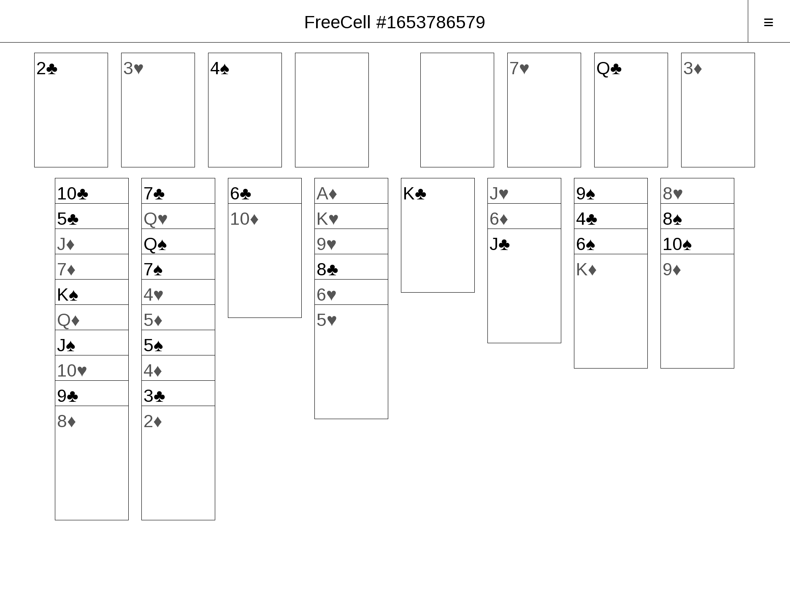

# pb-patience
PocketBook Patience Collection written in Eiffel.

## Dependencies
* PocketBook Eiffel Studio spec
* `wrap_inkview` from https://github.com/imustafin/wrap_inkview

## Games
Several games are included. Use the `≡` menu in the topbar to
select the game.

### FreeCell

Rules from http://www.solitairecity.com/Help/FreeCell.shtml

### Spider

Rules from http://www.solitairecity.com/Help/Spider.shtml

Three difficulty levels:
* 1 suit `♠♠♠♠`
* 2 suits `♠♠♥♥`
* 4 suits `♠♥♦♣`
